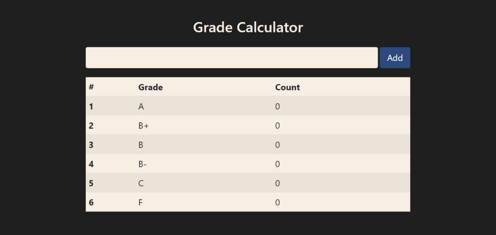

# Grading Calculator
Functional Javascript Grading  Calculator for Beginer Web Development Session IUBAT.
- 4th Project

### Features
- DOM Manipulation
- GetElementById
- HTML value,innerHTML
- Contional Rendaring

## Website Preview
### [Grading Calculator](https://shz-code.github.io/grade-calculator/)

